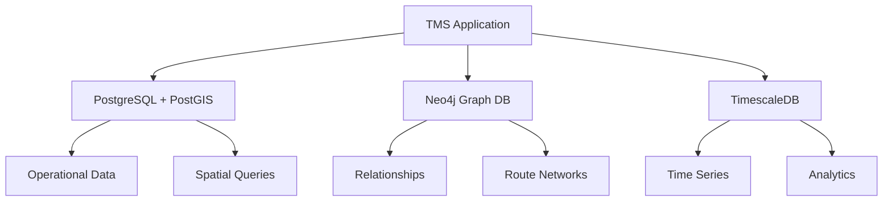

# Product Requirements Document (PRD)
## TMS Polyglot Persistence

**Version:** 1.0  
**Date:** July 3, 2025  
**Authors:** Product Team  
**Tags:** #TMS-Data #TMS-Infrastructure #polyglot-persistence #status/implemented #priority/high
**Related:** [[PRD-Overview]] | [[PRD-Database-Schema]] | [[PRD-Backend-System]] | [[PRD-Real-time-Analytics]]
**Dependencies:** [[PRD-Database-Schema]]
**Used By:** [[PRD-Backend-System]], [[PRD-Real-time-Analytics]], [[PRD-Stream-Processing]]
**Databases:** PostgreSQL, TimescaleDB, Neo4j, Redis

---

## 1. Executive Summary

### 1.1 Overview
The TMS Polyglot Persistence strategy leverages multiple specialized databases, each optimized for specific data patterns and query requirements. This approach maximizes performance, scalability, and functionality by selecting the optimal database technology for each specific use case within the Transportation Management System.

### 1.2 Core Philosophy
Rather than forcing all data into a single database technology, the polyglot persistence approach recognizes that different types of data have different storage, retrieval, and processing requirements. By using the right tool for each job, we achieve optimal performance and developer productivity.

### 1.3 Database Selection Strategy
Each database is selected based on:
- **Data Structure**: Relational, graph, time-series, or document patterns
- **Query Patterns**: OLTP, OLAP, spatial, or graph traversal requirements
- **Performance Requirements**: Latency, throughput, and scalability needs
- **Consistency Requirements**: ACID compliance vs. eventual consistency
- **Operational Complexity**: Maintenance, backup, and scaling considerations

---

## 2. Database Architecture Overview

### 2.1 Three-Database Architecture



### 2.2 Data Distribution Strategy
- **PostgreSQL + PostGIS**: Primary operational data store (70% of queries)
- **Neo4j**: Relationship and graph analysis (20% of queries)
- **TimescaleDB**: Time-series data and analytics (10% of queries)

---

## 3. PostgreSQL with PostGIS

### 3.1 Technology Selection Rationale
**PostgreSQL** selected for:
- **ACID Compliance**: Critical for transactional operations
- **Mature Ecosystem**: Extensive tooling and community support
- **Advanced Features**: JSON support, full-text search, arrays
- **Reliability**: Proven stability in enterprise environments

**PostGIS Extension** adds:
- **Spatial Data Types**: GEOMETRY and GEOGRAPHY support
- **Spatial Indexing**: GiST and SP-GiST indexes for performance
- **Spatial Functions**: Distance, intersection, containment operations
- **Standards Compliance**: OGC and ISO SQL/MM standards

### 3.2 Use Cases
#### 3.2.1 Primary Operational Data
```sql
-- Core business entities
Loads, Vehicles, Drivers, Customers, Routes, Orders

-- OLTP Operations
- CRUD operations on business entities
- Transaction processing
- Data integrity enforcement
- Referential integrity constraints
```

#### 3.2.2 Spatial Data Management
```sql
-- Spatial queries critical for logistics
- Vehicle location tracking
- Route geometry storage
- Delivery area definitions
- Proximity-based searches
- Geofencing operations

-- Example: Find nearest available drivers
SELECT d.*, ST_Distance(d.current_location, $pickup_point) as distance
FROM drivers d 
WHERE d.status = 'AVAILABLE'
ORDER BY d.current_location <-> $pickup_point
LIMIT 10;
```

### 3.3 Performance Optimizations
```sql
-- Spatial indexes for location-based queries
CREATE INDEX idx_vehicles_location ON vehicles USING GIST (current_location);
CREATE INDEX idx_loads_pickup_location ON loads USING GIST (pickup_location);

-- Composite indexes for common query patterns
CREATE INDEX idx_loads_status_date ON loads (status, pickup_date);
CREATE INDEX idx_drivers_status_location ON drivers (status) INCLUDE (current_location);

-- Partitioning for large tables
CREATE TABLE load_events_y2025 PARTITION OF load_events 
FOR VALUES FROM ('2025-01-01') TO ('2026-01-01');
```

### 3.4 Configuration for TMS Workload
```yaml
PostgreSQL Configuration:
  shared_buffers: 4GB
  effective_cache_size: 12GB
  work_mem: 256MB
  maintenance_work_mem: 1GB
  max_connections: 200
  checkpoint_segments: 64
  wal_buffers: 64MB
  
PostGIS Configuration:
  postgis.gdal_enabled_drivers: 'GTiff PNG JPEG'
  postgis.enable_outdb_rasters: true
  shared_preload_libraries: 'postgis-3'
```

---

## 4. Neo4j Graph Database

### 4.1 Technology Selection Rationale
**Neo4j** selected for:
- **Graph Native**: Purpose-built for connected data
- **Cypher Query Language**: Intuitive graph query syntax
- **Performance**: Optimized graph traversal algorithms
- **ACID Compliance**: Maintains consistency for graph operations
- **Scalability**: Clustering support for high availability

### 4.2 Use Cases
#### 4.2.1 Relationship Modeling
```cypher
// Driver-Vehicle relationships with qualifications
(:Driver)-[:QUALIFIED_FOR {certification: 'CDL-A', expires: '2025-12-31'}]->(:Vehicle)

// Route network optimization
(:Location)-[:ROUTE_TO {distance: 45.2, time: 35, cost: 12.50}]->(:Location)

// Customer-Carrier relationships
(:Customer)-[:PREFERRED_CARRIER {rating: 4.8, volume_discount: 0.15}]->(:Carrier)
```

#### 4.2.2 Route Optimization Algorithms
```cypher
// Find shortest path between locations
MATCH (start:Location {id: $pickup}), (end:Location {id: $delivery})
CALL gds.shortestPath.dijkstra.stream('route-network', {
    sourceNode: start,
    targetNode: end,
    relationshipWeightProperty: 'travel_time'
})
YIELD nodeId, cost
RETURN gds.util.asNode(nodeId).name AS location, cost
ORDER BY cost;
```

#### 4.2.3 Network Analysis
```cypher
// Identify critical route nodes (betweenness centrality)
CALL gds.betweenness.stream('route-network')
YIELD nodeId, score
RETURN gds.util.asNode(nodeId).name AS location, score
ORDER BY score DESC
LIMIT 10;
```

### 4.3 Graph Schema Design
```cypher
// Node labels and properties
(:Driver {id, name, license_class, experience_years, current_location})
(:Vehicle {id, type, capacity, fuel_efficiency, current_location})
(:Location {id, name, coordinates, type, operating_hours})
(:Route {id, distance, duration, waypoints})
(:Customer {id, name, credit_rating, volume_tier})

// Relationship types with properties
[:QUALIFIED_FOR {certification_date, expiry_date, restrictions}]
[:CURRENTLY_ASSIGNED {start_time, expected_duration}]
[:ROUTE_SEGMENT {distance, time, fuel_cost, toll_cost}]
[:SERVED_CUSTOMER {service_date, rating, on_time}]
[:OPTIMAL_PATH {calculated_at, algorithm_used, confidence}]
```

### 4.4 Performance Configuration
```yaml
Neo4j Configuration:
  dbms.memory.heap.initial_size: 2G
  dbms.memory.heap.max_size: 4G
  dbms.memory.pagecache.size: 4G
  dbms.tx_log.rotation.retention_policy: '100M size'
  dbms.checkpoint.interval.time: '15m'
  
Graph Algorithms:
  gds.graph.create: 'route-network' with relationship projections
  algorithm_timeout: '300s'
  concurrency: 4
```

---

## 5. TimescaleDB

### 5.1 Technology Selection Rationale
**TimescaleDB** selected for:
- **Time-Series Optimization**: Purpose-built for time-based data
- **PostgreSQL Compatibility**: Familiar SQL interface and ecosystem
- **Automatic Partitioning**: Efficient data organization by time
- **Compression**: Reduces storage costs for historical data
- **Continuous Aggregates**: Pre-computed analytics for performance

### 5.2 Infrastructure Requirements

#### 5.2.1 PostGIS Compatibility
**CRITICAL:** TimescaleDB deployment **MUST** include PostGIS extension support for spatial data operations.

**Docker Image Requirements:**
- **Use:** `timescale/timescaledb-ha:pg16` (includes PostGIS)
- **Avoid:** `timescale/timescaledb:latest-pg16` (PostGIS not included)

**Rationale:**
- Vehicle tracking data requires `GEOGRAPHY(POINT, 4326)` spatial types
- Route analytics need spatial distance calculations
- Performance metrics use geospatial aggregations
- Standard TimescaleDB images lack PostGIS extension

**Verification Commands:**
```sql
-- Verify both extensions are available
SELECT extname FROM pg_extension WHERE extname IN ('timescaledb', 'postgis');
-- Expected output: both 'timescaledb' and 'postgis' rows
```

**Deployment Configuration:**
```yaml
# docker-compose.yml - Correct Configuration
timescaledb:
  image: timescale/timescaledb-ha:pg16  # **Includes PostGIS**
  # ... other configuration
```

### 5.3 Use Cases
#### 5.3.1 Vehicle Tracking Analytics
```sql
-- High-frequency location data
CREATE TABLE vehicle_tracking (
    time TIMESTAMPTZ NOT NULL,
    vehicle_id UUID NOT NULL,
    location GEOGRAPHY(POINT, 4326),
    speed DECIMAL(5,2),
    fuel_level DECIMAL(5,2),
    mileage INTEGER
);

SELECT create_hypertable('vehicle_tracking', 'time');
```

#### 5.3.2 Performance Metrics
```sql
-- KPI calculations and trending
CREATE TABLE performance_metrics (
    time TIMESTAMPTZ NOT NULL,
    entity_type VARCHAR(20) NOT NULL,
    entity_id UUID NOT NULL,
    metric_name VARCHAR(50) NOT NULL,
    metric_value DECIMAL(15,4) NOT NULL,
    tags JSONB
);

SELECT create_hypertable('performance_metrics', 'time');
```

#### 5.3.3 Event Stream Storage
```sql
-- Historical event data for analytics
CREATE TABLE event_history (
    time TIMESTAMPTZ NOT NULL,
    event_type VARCHAR(50) NOT NULL,
    entity_id UUID,
    event_data JSONB NOT NULL,
    processing_latency INTEGER
);

SELECT create_hypertable('event_history', 'time');
```

### 5.4 Time-Series Optimizations
```sql
-- Continuous aggregates for real-time dashboards
CREATE MATERIALIZED VIEW hourly_vehicle_stats
WITH (timescaledb.continuous) AS
SELECT 
    time_bucket('1 hour', time) AS bucket,
    vehicle_id,
    AVG(speed) AS avg_speed,
    SUM(CASE WHEN speed > 0 THEN 1 ELSE 0 END) * 5 / 60.0 AS driving_hours,
    MAX(mileage) - MIN(mileage) AS miles_driven
FROM vehicle_tracking
GROUP BY bucket, vehicle_id;

-- Compression for historical data
SELECT add_compression_policy('vehicle_tracking', INTERVAL '7 days');

-- Retention policies
SELECT add_retention_policy('vehicle_tracking', INTERVAL '90 days');
```

### 5.5 Analytics Queries
```sql
-- Fleet utilization analysis
SELECT 
    DATE_TRUNC('day', bucket) as day,
    COUNT(DISTINCT vehicle_id) as active_vehicles,
    AVG(driving_hours) as avg_utilization,
    SUM(miles_driven) as total_miles
FROM hourly_vehicle_stats
WHERE bucket >= NOW() - INTERVAL '30 days'
GROUP BY day
ORDER BY day;

-- Performance trending
SELECT 
    time_bucket('1 day', time) as day,
    entity_type,
    metric_name,
    AVG(metric_value) as daily_avg,
    PERCENTILE_CONT(0.95) WITHIN GROUP (ORDER BY metric_value) as p95
FROM performance_metrics
WHERE time >= NOW() - INTERVAL '7 days'
GROUP BY day, entity_type, metric_name
ORDER BY day, entity_type, metric_name;
```

---

## 6. Data Synchronization Strategy

### 6.1 Event-Driven Synchronization
```yaml
Synchronization Pattern:
  trigger: Database changes in PostgreSQL
  mechanism: Kafka events via Debezium
  targets: Neo4j and TimescaleDB
  consistency: Eventual consistency with conflict resolution
  
Event Flow:
  PostgreSQL Change → Debezium → Kafka Topic → Consumer Services → Target DBs
```

### 6.2 Data Consistency Model
```yaml
Consistency Levels:
  PostgreSQL: Strong consistency (ACID)
  Neo4j: Strong consistency within transactions
  TimescaleDB: Eventual consistency for analytics
  
Cross-Database: Eventual consistency with monitoring
```

### 6.3 Conflict Resolution
```yaml
Conflict Resolution Strategy:
  timestamp_based: Latest timestamp wins
  source_priority: PostgreSQL as source of truth
  manual_resolution: For complex business logic conflicts
  audit_trail: All conflicts logged for analysis
```

---

## 7. Backup and Recovery Strategy

### 7.1 PostgreSQL Backup
```yaml
Backup Strategy:
  method: Continuous WAL archiving + daily base backups
  retention: 30 days of WAL files, 90 days of base backups
  recovery: Point-in-time recovery capability
  testing: Weekly recovery drills
```

### 7.2 Neo4j Backup
```yaml
Backup Strategy:
  method: Online backup with transaction log backup
  frequency: Daily full backup, hourly transaction logs
  retention: 30 days of backups
  recovery: Graph database restore with consistency checks
```

### 7.3 TimescaleDB Backup
```yaml
Backup Strategy:
  method: pg_dump with compression for time-series data
  frequency: Daily backups with retention policies
  retention: 30 days recent, monthly archives for 1 year
  recovery: Time-based restore with data validation
```

---

## 8. Monitoring and Observability

### 8.1 Database Health Monitoring
```yaml
PostgreSQL Metrics:
  - connection_count, active_queries, lock_waits
  - index_usage, table_bloat, query_performance
  - replication_lag, checkpoint_frequency

Neo4j Metrics:
  - heap_memory_usage, page_cache_hit_ratio
  - transaction_throughput, query_execution_time
  - relationship_traversal_performance

TimescaleDB Metrics:
  - chunk_compression_ratio, insert_throughput
  - continuous_aggregate_refresh_time
  - retention_policy_execution
```

### 8.2 Cross-Database Consistency Monitoring
```yaml
Consistency Checks:
  - row_count_validation across databases
  - data_freshness monitoring via timestamps
  - referential_integrity verification
  - event_processing_lag measurement
```

---

## 9. Performance Optimization

### 9.1 Query Optimization
```yaml
PostgreSQL:
  - Proper indexing strategies for spatial and temporal queries
  - Query plan analysis and optimization
  - Connection pooling (PgBouncer)
  - Read replicas for analytics workloads

Neo4j:
  - Graph algorithm optimizations
  - Index strategies for common traversals
  - Query tuning with EXPLAIN
  - Clustering for read scalability

TimescaleDB:
  - Chunk exclusion optimization
  - Compression configuration
  - Continuous aggregate tuning
  - Parallel query execution
```

### 9.2 Scalability Strategies
```yaml
Horizontal Scaling:
  PostgreSQL: Read replicas, sharding for very large datasets
  Neo4j: Clustering with read replicas
  TimescaleDB: Multi-node deployment for large time-series data

Vertical Scaling:
  Memory: Optimized for each database's access patterns
  CPU: Configured for query processing requirements
  Storage: SSD with appropriate IOPS for workload
```

---

## 10. Security and Compliance

### 10.1 Database Security
```yaml
Authentication:
  - Database-specific authentication mechanisms
  - Role-based access control (RBAC)
  - Service account management
  - Connection encryption (SSL/TLS)

Authorization:
  - Fine-grained permissions per database
  - Data access auditing
  - Query execution logging
  - Sensitive data masking
```

### 10.2 Data Protection
```yaml
Encryption:
  - Encryption at rest for all databases
  - Encryption in transit for all connections
  - Key management with rotation policies
  - Column-level encryption for PII

Compliance:
  - GDPR compliance for personal data
  - SOX compliance for financial transactions
  - Industry-specific requirements (DOT, FMCSA)
  - Data retention and deletion policies
```

---

## 11. Operational Excellence

### 11.1 Database Administration
```yaml
Maintenance Tasks:
  - Regular VACUUM and ANALYZE (PostgreSQL)
  - Index maintenance and optimization
  - Database statistics updates
  - Log rotation and cleanup

Capacity Planning:
  - Storage growth monitoring
  - Performance trending analysis
  - Resource utilization tracking
  - Scalability threshold planning
```

### 11.2 Disaster Recovery
```yaml
DR Strategy:
  - Multi-region backup storage
  - Automated failover procedures
  - Recovery time objectives (RTO): < 15 minutes
  - Recovery point objectives (RPO): < 5 minutes
  - Regular DR testing and validation
```

This polyglot persistence strategy provides the TMS with optimal data storage and retrieval capabilities while maintaining operational simplicity and ensuring each database technology is used for its strengths, resulting in a high-performance, scalable, and maintainable system architecture.
